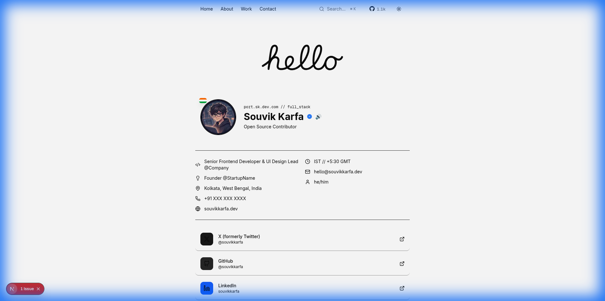

<div align="center">

# ✨ Souvik Karfa — Personal Portfolio

<p align="center">
  <strong>A modern, animated portfolio website built with Next.js 16, React 19, and cutting-edge web technologies</strong>
</p>

<p align="center">
  <a href="#-features">Features</a> •
  <a href="#-tech-stack">Tech Stack</a> •
  <a href="#-getting-started">Getting Started</a> •
  <a href="#-project-structure">Project Structure</a> •
  <a href="#-deployment">Deployment</a>
</p>

<p align="center">
  
  
  
  
  
</p>

</div>

---

## 📸 Preview

<p align="center">
  
</p>

---

## ✨ Features

### 🎨 **Modern UI/UX**

- **Dark/Light Theme Toggle** — Seamless theme switching with satisfying click sound feedback
- **Smooth Scrolling** — Lenis-powered butter-smooth scrolling experience
- **Glass Morphism** — Modern frosted glass effects throughout the UI
- **Responsive Design** — Pixel-perfect on all devices from mobile to desktop

### 🎬 **Rich Animations**

- **GSAP Animations** — Professional-grade animations for all interactive elements
- **Apple Hello Effect** — Signature animated greeting on the homepage
- **Hover Interactions** — Subtle scale and color transitions on all interactive elements
- **Staggered Reveals** — Beautiful entrance animations for content sections

### 🔊 **Interactive Audio**

- **Name Pronunciation** — Hover over the 🔊 icon to hear "Souvik Karfa" pronounced correctly
- **Theme Toggle Sound** — Satisfying click sound generated via Web Audio API when switching themes

### 🔍 **Command Palette**

- **Spotlight Search** — Press `⌘K` or `Ctrl+K` to open the command palette
- **Quick Navigation** — Instantly jump to any section of the portfolio
- **Keyboard-First** — Full keyboard navigation support

### 📱 **Responsive Components**

- **Navbar** — Animated navigation with mobile hamburger menu
- **Testimonials Marquee** — Auto-scrolling testimonials with smooth animations
- **GitHub Stars Badge** — Live GitHub repository star count display

---

## 🛠 Tech Stack

| Category          | Technologies                                   |
| ----------------- | ---------------------------------------------- |
| **Framework**     | Next.js 16 (App Router, Turbopack)             |
| **UI Library**    | React 19                                       |
| **Language**      | TypeScript 5                                   |
| **Styling**       | Tailwind CSS 4, CSS Variables                  |
| **Animations**    | GSAP 3.13, Motion (Framer Motion)              |
| **Scrolling**     | Lenis                                          |
| **UI Components** | Radix UI (Dialog, Tooltip, Collapsible)        |
| **Icons**         | Lucide React                                   |
| **Theming**       | next-themes                                    |
| **Utilities**     | clsx, tailwind-merge, class-variance-authority |

---

## 🚀 Getting Started

### Prerequisites

- **Node.js** 18.17 or later
- **npm**, **yarn**, **pnpm**, or **bun**

### Installation

1. **Clone the repository**

   ```bash
   git clone https://github.com/souvikkarfa/portfolio.git
   cd portfolio
   ```

2. **Install dependencies**

   ```bash
   npm install
   # or
   yarn install
   # or
   pnpm install
   ```

3. **Start the development server**

   ```bash
   npm run dev
   ```

4. **Open in browser**

   Navigate to [http://localhost:3000](http://localhost:3000)

---

## 📁 Project Structure

```
project-6/
├── public/                    # Static assets
│   ├── avatar.png            # Profile picture
│   └── readme-screenshot.png # README preview image
├── src/
│   ├── app/                   # Next.js App Router pages
│   │   ├── About/            # About section component
│   │   ├── Awards/           # Awards section
│   │   ├── Blog/             # Blog section
│   │   ├── Certificate/      # Certificates section
│   │   ├── Contact/          # Contact form section
│   │   ├── Experience/       # Work experience timeline
│   │   ├── Footer/           # Footer component
│   │   ├── Home/             # Hero/landing section
│   │   ├── Navbar/           # Navigation bar
│   │   ├── Testimonials/     # Testimonials marquee
│   │   ├── Work/             # Portfolio projects section
│   │   ├── globals.css       # Global styles & CSS variables
│   │   ├── layout.tsx        # Root layout with providers
│   │   └── page.tsx          # Main page composition
│   ├── components/            # Reusable components
│   │   ├── ui/               # Shadcn UI components
│   │   ├── CommandPalette.tsx# Spotlight search
│   │   ├── apple-hello-effect.tsx
│   │   ├── github-stars.tsx
│   │   ├── shimmering-text.tsx
│   │   ├── testimonials-marquee.tsx
│   │   ├── theme-switcher.tsx
│   │   └── work-experience.tsx
│   └── lib/                   # Utility functions
│       └── utils.ts          # cn() helper & utilities
├── components.json            # Shadcn UI configuration
├── next.config.ts            # Next.js configuration
├── tailwind.config.ts        # Tailwind CSS configuration
├── tsconfig.json             # TypeScript configuration
└── package.json              # Project dependencies
```

---

## 📜 Available Scripts

| Command         | Description                             |
| --------------- | --------------------------------------- |
| `npm run dev`   | Start development server with Turbopack |
| `npm run build` | Create production build                 |
| `npm run start` | Start production server                 |
| `npm run lint`  | Run ESLint for code quality             |

---

## 🌐 Deployment

### Vercel (Recommended)

The easiest way to deploy is using [Vercel](https://vercel.com):

[](https://vercel.com/new?utm_medium=default-template&filter=next.js&utm_source=create-next-app&utm_campaign=create-next-app-readme)

### Other Platforms

This project can also be deployed to:

- **Netlify** — Full Next.js support
- **AWS Amplify** — Serverless deployment
- **Docker** — Containerized deployment

---

## 🎯 Key Implementation Highlights

### 🔊 Text-to-Speech Name Pronunciation

```tsx
// Hover over the speaker icon to hear the name
onMouseEnter={() => {
  const utterance = new SpeechSynthesisUtterance("Souvik Karfa");
  utterance.lang = "en-US";
  window.speechSynthesis.speak(utterance);
}}
```

### 🎵 Theme Toggle Click Sound (Web Audio API)

```tsx
const playClickSound = () => {
  const audioContext = new AudioContext();
  const oscillator = audioContext.createOscillator();
  oscillator.frequency.value = 800;
  oscillator.type = "sine";
  // Creates a satisfying 100ms click sound
};
```

### ✨ GSAP Stagger Animations

```tsx
gsap.fromTo(
  ".social-link",
  { opacity: 0, x: -20 },
  { opacity: 1, x: 0, stagger: 0.1, ease: "power2.out" }
);
```

---

## 📄 License

This project is open source and available under the [MIT License](LICENSE).

---

<div align="center">

**Built with ❤️ by [Souvik Karfa](https://github.com/Mrkarfa)**

<p>
  <a href="https://twitter.com/Mrkarfa">Twitter</a> •
  <a href="https://linkedin.com/in/Mrkarfa">LinkedIn</a> •
  <a href="https://github.com/Mrkarfa">GitHub</a>
</p>

</div>
